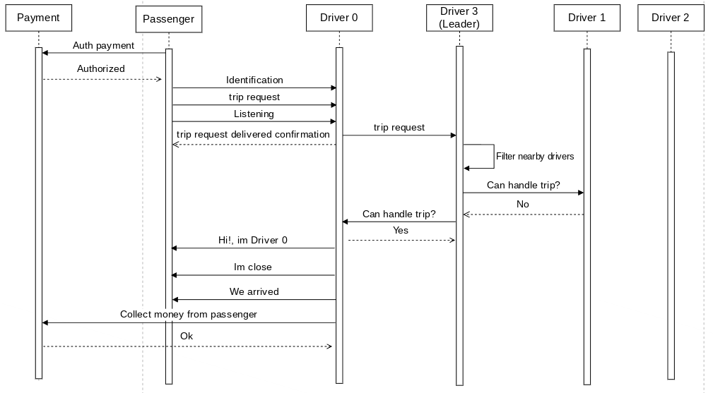
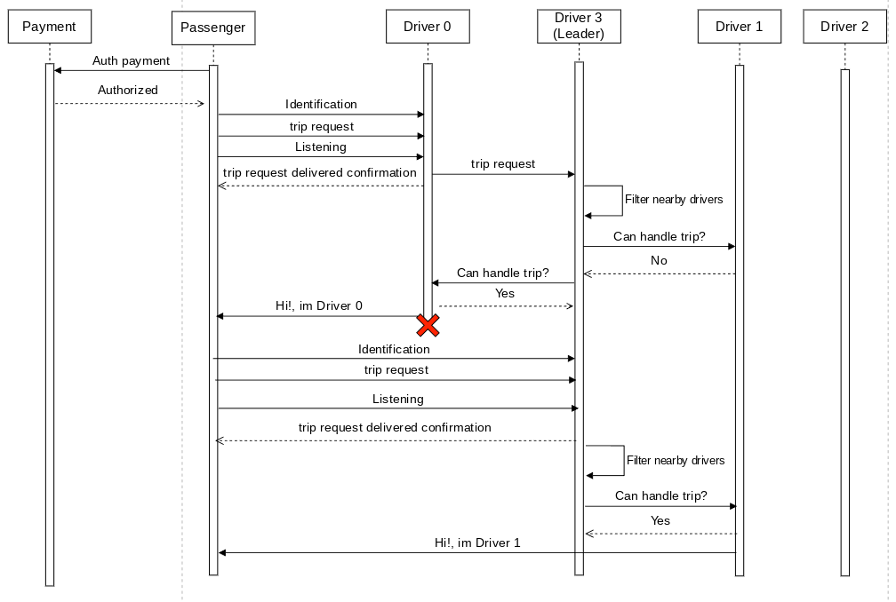
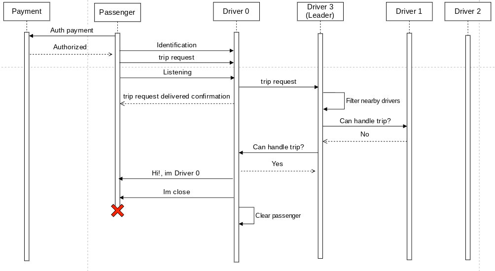

[](https://classroom.github.com/a/GAOi0Fq-)

| Alumno                            | E-mail             | Padron | Github      |
| --------------------------------- | ------------------ | ------ | ----------- |
| Maximiliano Nicolas Otero Silvera | motero@fi.uba.ar   | 108634 | @MaxiOtero6 |
| Juan Manuel Pascual Osorio        | jpascual@fi.uba.ar | 105916 | @JM-Pascual |
| Martin Juan Cwikla                | mcwikla@fi.uba.ar  | 107923 | @Tinchocw   |

# Arquitectura

## Aplicaciones

El sistema se compone de tres tipos de aplicaciones, Passengers los cuales solicitan viajes, Drivers los cuales aceptan y concretan esos viajes y Payment el cual controla el pago del viaje.


Como podemos ver en este diagrama, el pedido de los viajes lo recibe un driver al azar mediante un socket TCP. Estos mensajes estan en formato json y son serializados y deserializados utilizando el crate serde. El driver que recibe la request la redirige al driver lider y este se encarga de distribuir los viajes. Si el lider se cae o se une un nuevo driver a la red, se debe realizar la seleccion de lider utilizando el algoritmo de eleccion bully, debido a esto los driver deben estar conectados entre si. Para esta solucion tomamos la decision de conectar todos contra todos. Al completarse una eleccion con el mensaje 'Coordinator', se guarda la id del driver lider para poder identificarlo.

Los passenger por lo tanto, envian un viaje a un driver aleatorio (si este driver no contesta se prueba con otro driver, en caso de que no conteste ninguno no se podra hacer el viaje) esperando un mensaje confirmando un viaje, un mensaje de su driver asignado y su finalizacion o en caso contrario, un mensaje de error.

El Payment se conectara con cada Passenger esperando autorizacion de pago por parte del mismo y con cada Driver al llegar al destino, cobrando asi, el viaje.

### Driver


Dentro del proceso Driver encontramos los actores:

-   HandleTrip: Se responsabiliza en concretar la logica del viaje

-   CentralDriver: Se responsabiliza en orquestar los mensajes recibidos de los diversos actores con los cuales se comunica a estos mismos actores y de asignar el conductor al pasajero. En caso de que sea necesario se encargara de seleccionar un nuevo lider.

-   DriverConnection: Se responsabiliza de las comunicaciones mediante sockets con los demas Drivers, hay una instancia de este actor por cada Driver que exista.

-   PassengerConnection: Se responsabiliza de las comunicaciones mediante sockets con un Passenger

-   PaymentConnection: Se responsabiliza de las comunicaciones mediante sockets con el servicio de Payment

Estructura del Central Driver:

```Rust
pub struct CentralDriver {
    // Direccion del actor TripHandler
    trip_handler: Addr<TripHandler>,
    // Direccion del actor PassengerConnection
    passengers: Arc<Mutex<HashMap<u32, Addr<PassengerConnection>>>>,
    // Direcciones de los drivers segun su id
    connection_with_drivers: HashMap<u32, Addr<DriverConnection>>, // 0...N
    // Posiciones de los demas drivers segun su id,
    // cobra sentido si este driver es lider
    driver_positions: HashMap<u32, Position>,
    // Id del driver lider
    leader_id: Option<u32>,
    // Id del driver
    id: u32,
    // Timeout de la eleccion
    election_timeout: Option<SpawnHandle>,
}

impl Actor for CentralDriver {
    type Context = Context<Self>;
}

#[derive(Message)]
#[rtype(result = "()")]
pub struct NotifyPositionToLeader {
    pub driver_location: Position,
}

#[derive(Message)]
#[rtype(result = "()")]
pub struct SetDriverPosition {
    pub driver_id: u32,
    pub driver_position: Position,
}

#[derive(Message)]
#[rtype(result = "()")]
pub struct CollectMoneyPassenger {
    pub passenger_id: u32,
}

#[derive(Message)]
#[rtype(result = "()")]
pub struct CheckPaymentResponse {
    pub passenger_id: u32,
    pub response: bool,
}

#[derive(Message)]
#[rtype(result = "()")]
pub struct RemovePassengerConnection {
    pub id: u32,
}

#[derive(Message)]
#[rtype(result = "()")]
pub struct InsertDriverConnection {
    pub id: u32,
    pub addr: Addr<DriverConnection>,
}

#[derive(Message)]
#[rtype(result = "()")]
pub struct RemoveDriverConnection {
    pub id: u32,
}

#[derive(Message)]
#[rtype(result = "()")]
pub struct StartElection {}

#[derive(Message)]
#[rtype(result = "()")]
pub struct Election {
    pub sender_id: u32,
}

#[derive(Message)]
#[rtype(result = "()")]
pub struct Alive {
    pub responder_id: u32,
}

#[derive(Message)]
#[rtype(result = "()")]
pub struct Coordinator {
    pub leader_id: u32,
}

#[derive(Message)]
#[rtype(result = "Result<(), String>")]
pub struct RedirectNewTrip {
    pub passenger_id: u32,
    pub source: Position,
    pub destination: Position,
}

#[derive(Message)]
#[rtype(result = "()")]
pub struct FindDriver {
    pub passenger_id: u32,
    pub source: Position,
    pub destination: Position,
}

#[derive(Message)]
#[rtype(result = "Result<(), String>")]
pub struct CanHandleTrip {
    pub passenger_id: u32,
    pub source: Position,
    pub destination: Position,
}

#[derive(Message)]
#[rtype(result = "Result<(), String>")]
pub struct ConnectWithPassenger {
    pub passenger_id: u32,
}

#[derive(Message)]
#[rtype(result = "()")]
pub struct SendTripResponse {
    pub status: TripStatus,
    pub detail: String,
    pub passenger_id: u32,
}
```

```Rust
pub struct TripHandler {
    // Direccion del actor CentralDriver
    central_driver: Addr<CentralDriver>,
    // Posicion actual del driver
    current_location: Arc<Mutex<Position>>,
    // Id del pasajero actual
    passenger_id: Option<u32>,
    // Tarea del viaje
    trip_task: Option<SpawnHandle>,
}

impl Actor for TripHandler {
    type Context = Context<Self>;
}

#[derive(Message)]
#[rtype(result = "()")]
struct TripStart {
    passenger_id: u32,
    passenger_location: Position,
    destination: Position,
}

#[derive(Message)]
#[rtype(result = "bool")]
pub struct CanHandleTrip {
    pub passenger_id: u32,
    pub passenger_location: Position,
    pub destination: Position,
    pub self_id: u32,
}

#[derive(Message)]
#[rtype(result = "()")]
pub struct ClearPassenger {
    pub disconnected: bool,
    pub passenger_id: u32,
}

#[derive(Message)]
#[rtype(result = "()")]
pub struct ForceNotifyPosition {}
```

```Rust
pub struct PassengerConnection {
    // Direccion del actor CentralDriver
    central_driver: Addr<CentralDriver>,
    // Stream para enviar al passenger
    passenger_write_stream: Arc<Mutex<WriteHalf<TcpStream>>>,
    // ID del pasajero
    passenger_id: u32,
}

impl Actor for PassengerConnection {
    type Context = Context<Self>;
}

#[derive(Message)]
#[rtype(result = "()")]
pub struct SendAll {
    pub data: String,
}

#[derive(Message)]
#[rtype(result = "Result<(), String>")]
pub struct RecvAll {
    pub data: String,
}
```

```Rust
pub struct PaymentConnection {
    // Direccion del actor CentralDriver
    central_driver: Addr<CentralDriver>,
    // Stream para enviar al payment
    payment_write_stream: Arc<Mutex<WriteHalf<TcpStream>>>,
}

impl Actor for PaymentConnection {
    type Context = Context<Self>;
}

#[derive(Message)]
#[rtype(result = "()")]
pub struct SendAll {
    pub data: String,
}

#[derive(Message)]
#[rtype(result = "Result<(), String>")]
pub struct RecvAll {
    pub data: String,
}
```

```Rust
pub struct DriverConnection {
    // Direccion del actor CentralDriver
    central_driver: Addr<CentralDriver>,
    // Stream para enviar al driver
    driver_write_stream: Arc<Mutex<WriteHalf<TcpStream>>>,
    // ID del driver
    driver_id: u32,
    //Guarda el ack recibido para cada pasajero
    responses: HashMap<u32, Option<bool>>,
}

impl Actor for DriverConnection {
    type Context = Context<Self>;
}

#[derive(Message)]
#[rtype(result = "()")]
pub struct SendAll {
    pub data: String,
}

#[derive(Message)]
#[rtype(result = "Result<(), String>")]
pub struct RecvAll {
    pub data: String,
}

#[derive(Message)]
#[rtype(result = "Option<bool>")]
pub struct CheckACK {
    pub passenger_id: u32,
}
```

### Passenger


Dentro del proceso Passenger contamos con el main thread que se intenta conectar con el payment intentando autorizar el pago previo a hacer la request del viaje, si la tarjeta es rechazada se cancela la peticion, en caso contrario, se intenta conectar con un driver (prueba entre todos los posibles drivers en orden aleatorio), al conectarse lanza una tarea async de tokio y le realiza la request al cliente. Esta tarea async es un listener que espera que se conecte un nuevo driver (su chofer). Si no se conecta ningun driver en N segundos, se toma como que la request se perdio y se vuelve a conectar con un driver diferente repitiendo la request.

### Payment


Dentro del proceso payment contamos con el main thread que crea un listener en el puerto 3000 esperando nuevas request tanto como para autorizar el pago de un viaje o como para cobrar el viaje. Para los pagos autorizados, se guarda la id del pasajero y cuando un conductor quiere cobrarle al pasajero al momento de terminar el viaje se comprueba que la id del pasajero exista.

## Como se selecciona un Driver

Los Driver deben comunicar periodicamente al lider su posicion $(x, y) / x \in [0, 100], y \in [0, 100]$, el valor de esta posicion puede ser su posicion actual real o infinito (u32::MAX, u32::MAX), esta ultima en caso de que este conduciendo para un pasajero (en el remoto caso de que se le consulte a un driver el cual su posicion figura en el inifinito, este rechazara el viaje).

El lider al recibir un nuevo viaje, utilizara la ubicacion actual del pasajero que solicito el servicio para calcular la distancia entre el pasajero y cada conductor que tenga registrado, filtrando los conductores que esten a una distancia mayor a MAX_DISTANCE.
Luego, con todas las distancias recolectadas, se ira consultando a cada conductor en orden de distancia ascendente si quieren / pueden tomar el viaje.

Para calcular las distancias se utilizara la distancia Manhattan (o metrica del taxista / taxicab)

$d_1(\mathbf{p}, \mathbf{q}) = ||\mathbf{p} - \mathbf{q}||_1 = \sum_{i=1}^{n} |p_i - q_i|$

donde $\mathbf{p} = (p_1, p_2, ..., p_n) \text{ y } \mathbf{q} = (q_1, q_2, ..., q_n)$ son vectores

Ejemplo:

-   Se solicita un nuevo viaje en la posicion (1, 2) hasta (10, 20)

El lider recibe (1, 2) hasta (10, 20), en un instante previo, los Driver le comunicaron:

-   Driver 1: (3, 5)
-   Driver 2: (6, 1)
-   Driver 3: (u32::MAX, u32::MAX)

Primero, el lider descartara del calculo a los Drivers que esten alejados

-   Driver 1: (3, 5)
-   Driver 2: (6, 1)

Luego, calculara la distancia a (1, 2) usando la distancia Manhattan

-   Driver 1: |1 - 3| + |2 - 5| = 5
-   Driver 2: |1 - 6| + |2 - 1| = 6

Ahora, se consulta a un driver a la vez si quiere / puede tomar el viaje en orden de distancia al pasajero ascendente

-   Driver 1: No
-   Driver 2: Yes

Por lo cual, el driver 2 se comunicara a la brevedad con el pasajero y lo llevara a su destino.

## Conexiones

Se utilizaran sockets TCP, con los puertos definidos de la siguiente forma:

-   $Passenger \in [8000, 8020]$
-   $Driver \in [8080, 8100]$
-   Payment: 3000

### Mensajes JSON

#### Common messages

```Rust
#[derive(Serialize, Deserialize)]
pub enum CommonMessages {
    Identification { id: u32, type_: char },
}
```

#### Payment messages

```Rust
#[derive(Deserialize, Serialize)]
pub enum PaymentMessages {
    AuthPayment { passenger_id: u32 },
    CollectPayment { driver_id: u32, passenger_id: u32 },
}

#[derive(Serialize, Deserialize, Debug)]
pub enum PaymentResponses {
    AuthPayment { passenger_id: u32, response: bool },
    CollectPayment { passenger_id: u32, response: bool },
}
```

#### Trip messages

```Rust
#[derive(Serialize, Deserialize, Clone, Copy)]
pub enum TripStatus {
    RequestDelivered,
    Info,
    Success,
    Error,
}

#[derive(Serialize, Deserialize)]
pub enum TripMessages {
    TripRequest {
        source: Position,
        destination: Position,
    },
    TripResponse {
        status: TripStatus,
        detail: String,
    },
}
```

#### Driver messages

```Rust
#[derive(Serialize, Deserialize)]
pub enum DriverMessages {
    Coordinator {
        leader_id: u32,
    },
    Election {
        sender_id: u32,
    },
    Alive {
        responder_id: u32,
    },
    NotifyPosition {
        driver_id: u32,
        driver_position: Position,
    },
    TripRequest {
        passenger_id: u32,
        passenger_location: Position,
        destination: Position,
    },
    CanHandleTrip {
        passenger_id: u32,
        passenger_location: Position,
        destination: Position,
    },
    CanHandleTripACK {
        response: bool,
        passenger_id: u32,
    },
}
```

## Threads

### Driver


Cada driver va a tener una tarea async 'listener' la cual va a ser responsable de handlear nuevas conexiones con drivers o pasajeros.
En ambas conexiones, se espera que primero se identifiquen con su id y tipo ('P' (passenger) o 'D' (driver)), en caso de que sea un passenger, se esperara ademas la request del viaje, la cual se enviara al CentralDriver mediante el mensaje 'RedirectNewTrip'.
En el CentralDriver, si el driver es el driver lider, se notifica el mensaje 'FindDriver' con el cual lanza una nueva tarea async en el contexto del actor encargada de buscar un conductor para el pasajero. En caso de que el driver no sea el lider, le reenvia la request al lider mediante un socket TCP.

# Cambios post diseño

Commit viejo readme: e410c28993eee74049254d23db2837eeb70c74f8

### Identificacion del lider y request del pasajero

En el diseño, planteamos que el driver que sea seleccionado como lider debia tener un listener escuchando en el puerto 8080.
Esto lo cambiamos a que cada driver conozca la id del lider y conozca su puerto calculando `MIN_DRIVER_PORT + leader_id`,
y asi, se comunicara al igual que a un driver que no es lider.
Por lo tanto, $Driver \in [8080, 8100]$.
En cuanto a la request del pasajero, al cambiar el lider con un puerto fijo, el pasajero debe preguntar entre los 20 posibles puertos de un driver y le entregara la request del viaje al primero que se pueda conectar. Este driver le respondera que su request fue entregada y en la brevedad se comunicara un driver con el pasajero para comenzar su viaje.

### Actores en payment y passenger

Se descarto la idea de hacer las aplicaciones de payment y passenger con actores.
En el caso de payments tomamos esta decision ya que se requiere que sea 'una aplicacion simple que logea'.
En cuanto al pasajero, notamos que el flujo de la aplicacion era mas bien secuencial y hacerlo con actores era un overkill innecesario.

### Seleccion de driver

Al momento de seleccionar un driver, no se elige directamente al que mas cerca esta. En orden ascendente de distancia al pasajero, se le consulta a cada driver uno por uno si tomara el viaje, en caso positivo, el driver se comunica con el pasajero
y le avisa que esta en camino, en caso negativo, se le pregunta al proximo driver mas cercano.

### Tarea de seleccion de driver

Por los cambios anteriormente mencionados, se cambio la forma en la que se ejecuta la 'seleccion' (ya que no se elige, si no que se busca y consulta) del driver. Al llegar una request, se envia el mensaje "FindDriver" al CentralDriver, el cual, si es el lider (en caso contrario, ignorara el mensaje con un early return), lanzara una tarea async en el contexto del actor encargada de filtrar, ordenar y consultar a los drivers mas cercanos si quieren tomar el viaje.

### Envio de posicion del driver

El driver al comunicar su posicion, si llegara a iniciar un viaje, enviara al lider (u32::MAX, u32::MAX) de forma que no sea tomado en cuenta luego de filtrar, ya que las coordenadas las manejamos en un area conformada por $x \in [0, 100]$ e $y \in [0, 100]$

# Casos de interes

## Viaje exitoso



Dados

-   Driver 0 con posicion (0, 0)
-   Driver 1 con posicion (5, 5)
-   Driver 2 con posicion (10, 10)
-   Driver 3 con posicion (15, 15)
-   Passenger que quiere ir desde (3,3) -> (10, 10)

El pasajero principalmente autoriza el pago con el servicio de Payment, al ser autorizado prosigue.
Luego se conecta aleatoriamente con el driver 0, y le envia 'CommonMessages::Identification {id, type\_: 'P'}' y 'TripMessages::TripRequest {source: (3,3), destination: (10, 10)}'.
El driver 0 redirige la request al driver 3 (lider) y le responde al pasajero que su request fue entregada cerrando asi la conexion.
El driver 3 lanza una tarea async la cual clona las posiciones de los drivers en ese instante, filtra los drivers mas cercanos, los ordena en orden de distancia ascendente y se queda con los ids ordenados. Luego va preguntando uno por uno si quieren tomar el viaje. En este caso, el mas cercano es el driver 1, el cual rechaza la solicitud, siguiendo por el driver 0 el cual acepta la solicitud, el driver 3 y el driver 2 estaban a una distancia mayor a MAX_DISTANCE.
Entonces, el driver 0 se conecta con el pasajero avisandole que sera su chofer, le avisa cuando esta cerca y cuando se llega a destino.
Al terminar el viaje, el driver 0 se comunica con el servicio de Payment confirmando asi el cobro al pasajero.

## Se cae el driver



En este caso, se hace la request igual que en el caso anterior, solo que durante el viaje, se desconecta el driver 0. Entonces, el cliente al recibir el broken pipe, realiza nuevamente la request. Y se inicia nuevamente la busqueda de un driver.

## Se cae el pasajero



En este caso, se hace la request, se asigna un driver, y en un momento el pasajero se desconecta. Entonces el driver al ver que el pasajero se desconecto toma la decision de cancelar el viaje.
