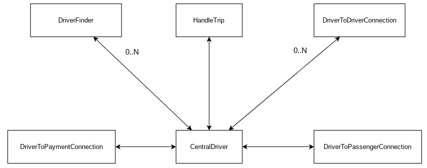

| Alumno                            | E-mail             | Padron | Github      |
| --------------------------------- | ------------------ | ------ | ----------- |
| Maximiliano Nicolas Otero Silvera | motero@fi.uba.ar   | 108634 | @MaxiOtero6 |
| Juan Manuel Pascual Osorio        | jpascual@fi.uba.ar | 105916 | @JM-Pascual |
| Martin Juan Cwikla                | mcwikla@fi.uba.ar  | 107923 | @Tinchocw   |

# Arquitectura

## Aplicaciones

El sistema se compone de tres tipos de aplicaciones, Passengers los cuales solicitan viajes, Drivers los cuales aceptan y concretan esos viajes y Posnet el cual controla el pago del viaje.

Como podemos ver en este diagrama, el pedido de los viajes lo recibe el driver 1 mediante un socket TCP, driver el cual es el lider y distribuye estos viajes entre los demas drivers. Si el lider falla, se debe elegir otro lider utilizando un algoritmo de eleccion, debido a esto los driver deben estar conectados entre si.

Los passenger por lo tanto, envian viajes al Driver lider esperando un mensaje confirmando un viaje, y su finalizacion o en caso contrario, un mensaje de error

El PosNet se conectara con cada Passenger esperando autorizacion de pago por parte del mismo y cobrando la cantidad indicada luego de finalizar el viaje.

### Driver

Dentro del proceso Driver encontramos los actores:

-   HandleDriveDriver: Se responsabiliza en concretar la logica del viaje

-   CentralDriver: Se responsabiliza en orquestar los mensajes recibidos de los diversos actores con los cuales se comunica a estos mismos actores

-   DriverToDriverConnection: Se responsabiliza de las comunicaciones mediante sockets con los demas Drivers, hay una instancia de este actor por cada Driver que exista

-   DriverToPassengerConnection: Se responsabiliza de las comunicaciones mediante sockets con el Passenger actual

### Passenger

Dentro del proceso Passenger encontramos los actores:

-   HandleDrivePassenger: Parsea el input del usuario

-   PassengerToDriverConnection: Le envia un mensaje al Driver lider comunicando los datos del viaje que el Passenger quiere iniciar

-   HandleDriverResponse: Se encarga de contemplar la respuesta recibida por parte del Driver

-   PassengerToPosnetConnection: Le envia un mensaje al Posnet comunicando que el viaje finalizo con exito

### PosNet

Dentro del proceso Posnet encontramos los actores:

-   PosnetToPassengerConnection: Se comunica con el Passenger mediante sockets TCP

-   HandlePayment: Maneja los mensajes recibidos por parte del Passenger, ya sea autorizar un pago o cobrar el monto despues de terminar el viaje.
