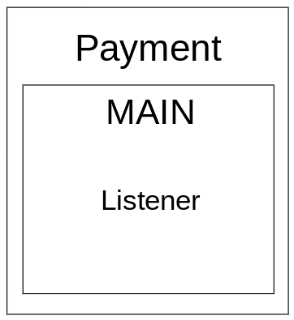
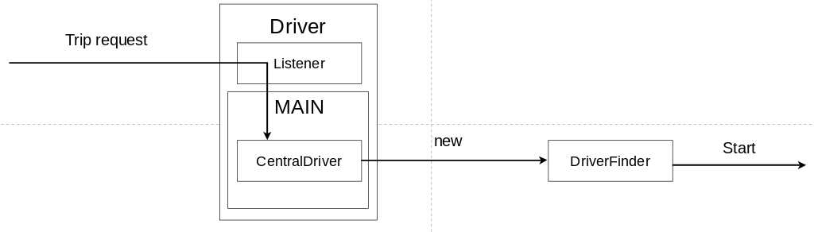

[](https://classroom.github.com/a/GAOi0Fq-)

| Alumno                            | E-mail             | Padron | Github      |
| --------------------------------- | ------------------ | ------ | ----------- |
| Maximiliano Nicolas Otero Silvera | motero@fi.uba.ar   | 108634 | @MaxiOtero6 |
| Juan Manuel Pascual Osorio        | jpascual@fi.uba.ar | 105916 | @JM-Pascual |
| Martin Juan Cwikla                | mcwikla@fi.uba.ar  | 107923 | @Tinchocw   |

# Arquitectura

## Aplicaciones

El sistema se compone de tres tipos de aplicaciones, Passengers los cuales solicitan viajes, Drivers los cuales aceptan y concretan esos viajes y Payment el cual controla el pago del viaje.


Como podemos ver en este diagrama, el pedido de los viajes lo recibe el driver 1 mediante un socket TCP, driver el cual es el lider y distribuye estos viajes entre los demas drivers. Si el lider falla, se debe elegir otro lider utilizando un algoritmo de eleccion, debido a esto los driver deben estar conectados entre si.

Los passenger por lo tanto, envian viajes al Driver lider esperando un mensaje confirmando un viaje, y su finalizacion o en caso contrario, un mensaje de error

El Payment se conectara con cada Passenger esperando autorizacion de pago por parte del mismo y con cada Driver esperando confirmacion de llegada a destino cobrando asi, la cantidad indicada luego de finalizar el viaje.

### Driver


Dentro del proceso Driver encontramos los actores:

-   HandleTrip: Se responsabiliza en concretar la logica del viaje

-   CentralDriver: Se responsabiliza en orquestar los mensajes recibidos de los diversos actores con los cuales se comunica a estos mismos actores y de asignar el conductor al pasajero. En caso de que sea necesario se encargara de seleccionar un nuevo lider.

-   DriverToDriverConnection: Se responsabiliza de las comunicaciones mediante sockets con los demas Drivers, hay una instancia de este actor por cada Driver que exista.

-   DriverToPassengerConnection: Se responsabiliza de las comunicaciones mediante sockets con el Passenger actual

Estructura aproximada del Central Driver:

```Rust
struct CentralDriver {
    // Direccion del actor TripHandler
    trip_handler: Addr<TripHandler>,
    // Direccion del actor PassengerConnection
    connection_with_passenger: Addr<PassengerConnection>,
    // Direccion del actor PaymentConnection
    connection_with_payment: Addr<PaymentConnection>,
    // Direcciones de los drivers segun su id
    connection_with_drivers: HashMap<u32, Addr<DriverConnection>>, // 0...N
    // Posicion actual del driver
    current_location: (u32, u32)
    // Posiciones de los demas drivers segun su id,
    // cobra sentido si este driver es lider
    driver_positions: Arc<RwLock<HashMap<u32, (u32, u32)>>>,
}

impl Actor for CentralDriver {
    type Context = Context<Self>;
}

#[derive(Message)]
#[rtype(result = "()")]
struct InfoPosition {
  driver_location: (u32, u32),
}

```

```Rust
struct TripHandler {
    // Direccion del actor CentralDriver
    central_driver: Addr<CentralDriver>,
}

impl Actor for TripHandler {
    type Context = Context<Self>;
}

#[derive(Message)]
#[rtype(result = String)]
struct TripStart {
  passenger_id: u32
  passenger_location: (u32, u32)
  destination: (u32, u32)
}
```

```Rust
struct PassengerConnection {
    // Direccion del actor CentralDriver
    central_driver: Addr<CentralDriver>,
    // Stream para enviar al passenger
    passenger_write_stream: Arc<Mutex<WriteHalf<TcpStream>>>,
    // Direccion del stream del passenger
    passenger_addr: Option<SocketAddr>,

}

impl Actor for PassengerConnection {
    type Context = Context<Self>;
}

#[derive(Message)]
#[rtype(result = "()")]
struct TripStatus {
    log: String
    type: String
}
```

```Rust
struct PaymentConnection {
    // Direccion del actor CentralDriver
    central_driver: Addr<CentralDriver>,
    // Stream para enviar al payment
    payment_write_stream: Arc<Mutex<WriteHalf<TcpStream>>>,
    // Direccion del stream del payment
    payment_addr: Option<SocketAddr>,
}

impl Actor for PaymentConnection {
    type Context = Context<Self>;
}

#[derive(Message)]
#[rtype(result = "()")]
struct CollectMoneyPassenger {
    passenger_id: u32
}
```

```Rust
struct DriverConnection {
    // Direccion del actor CentralDriver
    central_driver: Addr<CentralDriver>,
    // Stream para enviar al driver
    driver_write_stream: Arc<Mutex<WriteHalf<TcpStream>>>,
    // Direccion del stream del driver
    driver_addr: Option<SocketAddr>,
}

impl Actor for DriverConnection {
    type Context = Context<Self>;
}

#[derive(Message)]
#[rtype(result = "u32")]
struct LeaderStatus {
    type: String,
    ids: String
}
```

### Passenger


Dentro del proceso Passenger encontramos los actores:

-   HandleDrivePassenger: Parsea el input del usuario

-   PassengerToDriverConnection: Le envia un mensaje al Driver lider comunicando los datos del viaje que el Passenger quiere iniciar

-   HandleDriverResponse: Se encarga de contemplar la respuesta recibida por parte del Driver. En caso de error, ya sea que no se tomo el viaje o que ocurrio algun otro tipo de error, no se comunicara la intencion de cobro al PassengerToPaymentConnection.

-   PassengerToPaymentConnection: Le envia un mensaje al Payment comunicando que el passenger esta en condiciones de pagar

Estructura aproximada del HandleDriverResponse:

```Rust
struct HandleDrivePassenger {
    // ID del passenger
    id: u32,
    // Posicion inicial del passenger
    passenger_position: (u32, u32),
    // Posicion destino del passenger
    destination: (u32, u32),
}

impl Actor for HandleDrivePassenger {
    type Context = Context<Self>;
}
```

```Rust
struct PassengerToDriverConnection {
    // ID del passenger
    id: u32,
    // Stream para enviar al driver
    driver_write_stream: Arc<Mutex<WriteHalf<TcpStream>>>,
    // Direccion del stream del driver
    driver_addr: Option<SocketAddr>,
}

impl Actor for PassengerToDriverConnection {
    type Context = Context<Self>;
}

#[derive(Message)]
#[rtype(result = "()")]
struct SendTrip {
    passenger_position: (u32, u32),
    destination: (u32, u32)
}
```

```Rust
struct HandleDriverResponse {
    // ID del passenger
    id: u32,
    // Respuesta del driver
    response: String
}

impl Actor for HandleDriverResponse {
    type Context = Context<Self>;
}

#[derive(Message)]
#[rtype(result = "()")]
struct HandleResponse {
  type: String,
  data: String
}
```

```Rust
struct PaymentConnection {
    // ID del passenger
    id: u32,
    // Stream para enviar al payment
    payment_write_stream: Arc<Mutex<WriteHalf<TcpStream>>>,
    // Direccion del stream del payment
    payment_addr: Option<SocketAddr>
}

impl Actor for PaymentConnection {
    type Context = Context<Self>;
}

#[derive(Message)]
#[rtype(result = "()")]
struct PaymentRequest {
  amount_to_charge: f64,
}
```

### Payment



Dentro del proceso Payment encontramos los actores:

-   PaymentToPassengerConnection: Se comunica con el Passenger mediante sockets TCP

-   PaymentToDriverConnection: Se comunica con el Driver mediante sockets TCP

-   HandlePayment: Maneja los mensajes recibidos, ya sea autorizar un pago o cobrar el monto despues de terminar el viaje.

Estructura aproximada del Payment:

```Rust
struct PaymentHandler {
  // Direccion al actor DriverPaymentConnection
  driver_conection: Addr<DriverPaymentConnection>,
  // Direccion al actor PassengerPaymentConnection
  connection_with_passenger: Addr<PassengerPaymentConnection>,
}

impl Actor for PaymentHandler {
    type Context = Context<Self>;
}

#[rtype(result = "String")]
struct AllowPayment {
  passenger_id: u32
}
```

```Rust
struct DriverPaymentConnection {
    // Stream para enviar al driver
    driver_write_stream: Arc<Mutex<WriteHalf<TcpStream>>>
    // Direccion del stream del driver
    driver_addr: Option<SocketAddr>
    // Direccion del actor PaymentHandler
    payment: Addr<PaymentHandler>
}

impl Actor for DriverPaymentConnection {
    type Context = Context<Self>;
}
```

```Rust
struct PassengerPaymentConnection {
    // Stream para enviar al passenger
    passenger_write_stream: Arc<Mutex<WriteHalf<TcpStream>>>
    // Direccion del stream del passenger
    passenger_addr: Option<SocketAddr>
    // Direccion del actor PaymentHandler
    payment: Addr<PaymentHandler>
}

impl Actor for PassengerPaymentConnection {
    type Context = Context<Self>;
}
```

## Como se selecciona un Driver

Los Driver deben comunicar periodicamente al lider su posicion, el valor de esta posicion puede ser
su posicion actual real o una posicion invalida como **(-1, -1)** la cual el lider entendera que este
conductor se encuentra ocupado.

El lider al recibir un nuevo viaje, utilizara la ubicacion
actual del pasajero que solicito el servicio para calcular la distancia entre el pasajero y cada
conductor que tenga registrado, filtrando los conductores que tengan posiciones invalidas.
Luego, con todas las distancias recolectadas, se elegira al conductor con la menor distancia
para que tome el viaje.

Para calcular las distancias se utilizara la distancia Manhattan (o metrica del taxista / taxicab)

$d_1(\mathbf{p}, \mathbf{q}) = ||\mathbf{p} - \mathbf{q}||_1 = \sum_{i=1}^{n} |p_i - q_i|$

donde $\mathbf{p} = (p_1, p_2, ..., p_n) \text{ y } \mathbf{q} = (q_1, q_2, ..., q_n)$ son vectores

Ejemplo:

-   Se solicita un nuevo viaje en la posicion (1, 2) hasta (10, 20)

El lider recibe (1, 2) hasta (10, 20), en un instante previo, los Driver le comunicaron:

-   Driver 1: (3, 5)
-   Driver 2: (6, 1)
-   Driver 3: (-1, -1) // Ocupado

Primero, el lider descartara del calculo a los Drivers que esten ocupados

-   Driver 1: (3, 5)
-   Driver 2: (6, 1)

Luego, calculara la distancia a (1, 2) usando la distancia Manhattan

-   Driver 1: |1 - 3| + |2 - 5| = 5
-   Driver 2: |1 - 6| + |2 - 1| = 6

Quendando asi, encargado del viaje el Driver 1

## Conexiones

Se utilizaran sockets TCP, con los puertos definidos de la siguiente forma:

-   $Passenger \in [8000, 8020]$
-   DriverLeader: 8080
-   $Passenger \in [8081, 8101]$
-   Payment: 3000

Planteamos que el Driver que ejerza de lider debe tener un listener escuchando en el puerto 8080.
Esto con el fin de que sea transparente para el pasajero el saber a donde comunicarse para iniciar un viaje.

## Threads

### Driver



Lo que podemos ver en este diagrama, es un Driver que casualmente es el lider.
En este caso, el driver va a tener un thread 'leader' el cual va a ser responsable de handlear nuevas request de viajes.
Estas requests las va a recibir mediante un listener y va a pasar los datos recibidos incluyendo el stream
y su direccion a un thread pool en el cual la finalidad de las tareas ingresadas a este pool sera seleccionar el
Driver mas acorde para el viaje y comunicarle al pasajero que su viaje se puede realizar,
o no en caso de que no haya un Driver disponible.
