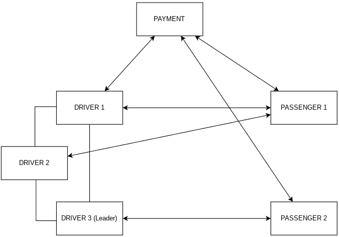

[](https://classroom.github.com/a/GAOi0Fq-)

| Alumno                            | E-mail             | Padron | Github      |
| --------------------------------- | ------------------ | ------ | ----------- |
| Maximiliano Nicolas Otero Silvera | motero@fi.uba.ar   | 108634 | @MaxiOtero6 |
| Juan Manuel Pascual Osorio        | jpascual@fi.uba.ar | 105916 | @JM-Pascual |
| Martin Juan Cwikla                | mcwikla@fi.uba.ar  | 107923 | @Tinchocw   |

# Arquitectura

## Aplicaciones

El sistema se compone de tres tipos de aplicaciones, Passengers los cuales solicitan viajes, Drivers los cuales aceptan y concretan esos viajes y Payment el cual controla el pago del viaje.



Como podemos ver en este diagrama, el pedido de los viajes lo recibe el driver 1 mediante un socket TCP, driver el cual es el lider y distribuye estos viajes entre los demas drivers. Si el lider falla, se debe elegir otro lider utilizando un algoritmo de eleccion, debido a esto los driver deben estar conectados entre si.

Los passenger por lo tanto, envian viajes al Driver lider esperando un mensaje confirmando un viaje, y su finalizacion o en caso contrario, un mensaje de error

El Payment se conectara con cada Passenger esperando autorizacion de pago por parte del mismo y con cada Driver esperando confirmacion de llegada a destino cobrando asi, la cantidad indicada luego de finalizar el viaje.

### Driver


Dentro del proceso Driver encontramos los actores:

-   HandleTrip: Se responsabiliza en concretar la logica del viaje

-   CentralDriver: Se responsabiliza en orquestar los mensajes recibidos de los diversos actores con los cuales se comunica a estos mismos actores y de asignar el conductor al pasajero. En caso de que sea necesario se encargara de seleccionar un nuevo lider.

-   DriverToDriverConnection: Se responsabiliza de las comunicaciones mediante sockets con los demas Drivers, hay una instancia de este actor por cada Driver que exista.

-   DriverToPassengerConnection: Se responsabiliza de las comunicaciones mediante sockets con el Passenger actual

Estructura aproximada del Central Driver:

```Rust
struct CentralDriver {
  trip_handler: Addr<TripHandler>,
  connection_with_passenger: Addr<PassengerConnection>,
  connection_with_payment: Addr<PaymentConnection>,
  connection_with_drivers: Vec<Addr<DriverConnection>>, // 0...N
  current_location: (u32, u32),
}

impl Actor for CentralDriver {
    type Context = Context<Self>;
}

#[derive(Message)]
#[rtype(result = i64)]
struct TripRequest {
  passenger_location: (u32, u32),
}

#[derive(Message)]
#[rtype(result = i64)]
struct TripStart {
  distance_to_destination: u32,
}
```

### Passenger


Dentro del proceso Passenger encontramos los actores:

-   HandleDrivePassenger: Parsea el input del usuario

-   PassengerToDriverConnection: Le envia un mensaje al Driver lider comunicando los datos del viaje que el Passenger quiere iniciar

-   HandleDriverResponse: Se encarga de contemplar la respuesta recibida por parte del Driver. En caso de error, ya sea que no se tomo el viaje o que ocurrio algun otro tipo de error, no se comunicara la intencion de cobro al PassengerToPaymentConnection.

-   PassengerToPaymentConnection: Le envia un mensaje al Payment comunicando que el passenger esta en condiciones de pagar

Estructura aproximada del HandleDriverResponse:

```Rust
struct HandleDriverResponse {
    connection_with_payment: Addr<PaymentConnection>,
}

impl Actor for HandleDriverResponse {
    type Context = Context<Self>;
}

#[derive(Message)]
#[rtype(result = "String")]
struct VerifyPaymentMethod {
  card_number: str,
  cvv: str,
}

#[derive(Message)]
#[rtype(result = "String")]
struct PaymentRequest {
  amount_to_charge: f64,
}
```

### Payment


Dentro del proceso Payment encontramos los actores:

-   PaymentToPassengerConnection: Se comunica con el Passenger mediante sockets TCP

-   PaymentToDriverConnection: Se comunica con el Driver mediante sockets TCP

-   HandlePayment: Maneja los mensajes recibidos, ya sea autorizar un pago o cobrar el monto despues de terminar el viaje.

Estructura aproximada del Payment:

```Rust
struct PaymentHandler {
  driver_conection: Addr<DriverPaymentConnection>,
  connection_with_passenger: Addr<PassengerPaymentConnection>,
}

impl Actor for PaymentHandler {
    type Context = Context<Self>;
}
```

## Como se selecciona un Driver

El lider al recibir un nuevo viaje, enviara a cada Driver (incluido el mismo) la ubicacion actual del pasajero que solicito el servicio, y estos responderan en caso de poder / querer tomar el viaje con su distancia hacia el pasajero, en caso contrario, responderan **-1** por defecto siendo este valor un indicativo de que no tomaran este viaje. Luego, con todas las distancias recolectadas, se elegira al conductor con la menor distancia valida para que tome el viaje.
